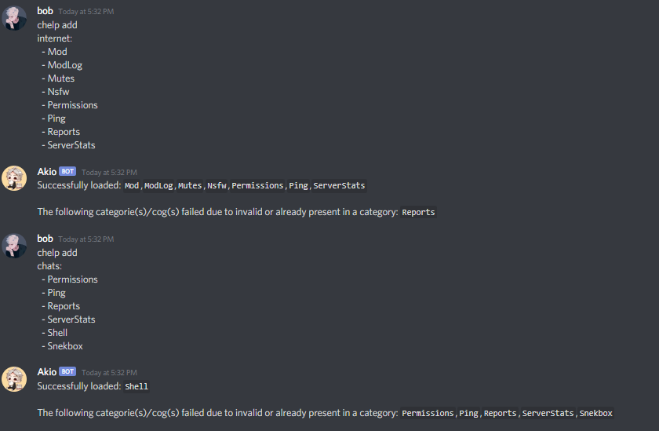
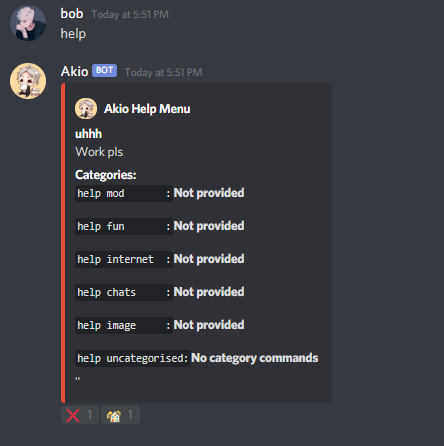
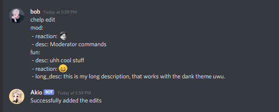
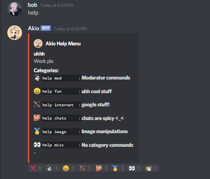
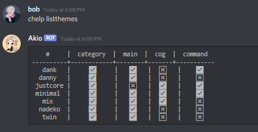
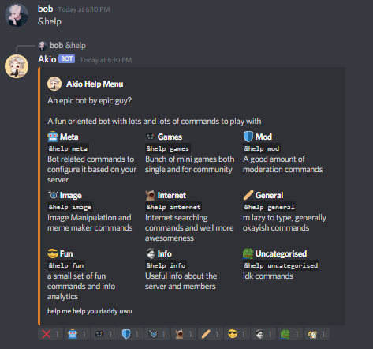
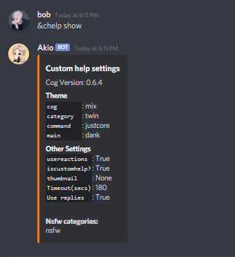

A Customisable Custom Help Cog For Red:
=======================================

| Couldn't get a shorter title. Anyways, the cog introduces categories, meaning you can now bunch up cogs into one blob and give it a name,description and reaction.
|
| This cog is made cause I didn't like 30 help pages for my bot and I wanted to bunch my cogs.
|
| Use ``[p]chelp`` to see what can be customised and ``[p]chelp settings`` for even more customisations.
|
| As an additional bonus, if you have the alias cog loaded, those aliases will also be retrieved.

Setup
-----
*Note: Use* ``[p]chelp set 1`` *to set your help to the custom help, else it'll remain as the normal one*

1. | Start by doing ``[p]chelp list`` to list all your cogs

2. | Pick the cogs you need to group into a category.
   | Then use ``[p]chelp create``, now add the catergorized cogs as shown below.

   .. note::
    This command can be run as many times as needed and can load up cogs into existing categories as well.

   | This is the yaml syntax.

   .. code:: yaml

      category1:
       - Cog1
       - Cog2
      category2:
       - Cog3
       - Cog4

   | |create categories|

3. Congrats, you just bunched up cogs into categories. Now you can do
   ``[p]help <category>`` to load the help of all those cogs in the category.

4. | Now ``[p]help`` should show those categories to be that much cooler!
   | |raw help|

5. | Yay! *But wait*, we need to fill in the blanks.
   | Use ``[p]chelp edit`` to add the everything you need to customise a category.
   | The format is simply:

   .. code:: yaml

      category:
      - name: new name (ONLY use this to rename! else this isn't necessary)
      - desc: new description
      - long_desc: long description
      - reaction: reaction emoji

   | Feel free to mix and match to your liking, as in example below:
   | |editz|

6. | Once you've edited everything, your help menu will look even more impressive!
   | |Default command|

7.  *But wait, there's even more.*

Themes
------

Introducing themes that were shamesslessly ripped off from other bots cause I'm bad at designing.

1. | ``[p]chelp listthemes``
   | This will get all the themes and the features available in each of them.
   | |list themes|

2. | ``[p]chelp load <theme> <feature>``
   | This will load the respective theme for a particular feature.

   .. note::
      | You can use ``[p]chelp load <theme> all`` to load all the available feature in that theme.
      | You can also mix and match any theme. (You will not lose configured categories. <_<)

   | An example of ``[p]chelp load dank main`` is shown below:
   | |image5|

3. | ``[p]chelp show``
   | This will show what themes are loaded, along with your current settings.
   | |image6|

4. | ``[p]chelp unload <feature>``
   | Run this command to reset the given feature back to default.

5. | ``[p]chelp reset``
   | This command will reset the themes to default.

.. note::
    This won't revert to the regular Red help menu, to do so use ``[p]chelp set 0``

6. Whew, wait you thought we were done? *Or are we...*

Category Configuration
----------------------

| Custom Help also has additional configuration available to hide categories in
| certain circumstances, such as ``developer`` or even ``NSFW`` from public
| view.

1. | ``[p]chelp dev``
   | This will hide categories and only be visible by the bot owner.

2. | ``[p]chelp nsfw``
   | This will hide categories to only be visible within NSFW-marked channels.

3. | ``[p]chelp auto``
   | To make a pre-formatted list of categories, this will take tags from your installed cogs
   | and auto-generate a list for you to use in ``[p]chelp create``.

4. | ``[p]chelp info``
   | This will provide a description of themes available.

Custom Help Settings
--------------------

| Additional settings in Custom Help can be configured via ``[p]chelp settings``, including but not limited to
| custom navigation, thumbnails, using replies, and more.

1. | ``[p]chelp settings arrows``
   | Custom Navigation, YAY!
   | If you feel the default arrow icons are boring and plain, and you want to spice up navigation, you're probably looking for this. (Supports custom emotes.)
   | When using custom emotes from servers, your bot must also have access to them to be used.
   | You can use the emote ID (``:some_emote:123456789123``), or use the emote itself in the following format:

   .. code-block:: javascript

      left : emoji
      right: emoji
      cross: emoji
      home : emoji
      force_left: emoji
      force_right: emoji

2. | ``[p]chelp settings thumbnail``
   | If you ever wanted to add a little image on the top right of the embed, you can set the image
   | for the thumbnail with a valid link.

   .. note::
      The link must be a direct image link, ending in GIF, JPG, or PNG.

3. | ``[p]chelp settings timeout``
   | This will change how long the reaction menu stays (in seconds) before being removed.

4. | ``[p]chelp settings usebuttons``
   | If you want to use buttons instead of emote reactions for menus, you'll want to use this command.

   .. note::
      In order to use buttons, you need ``slashtags`` from `Phen-cogs <https://github.com/phenom4n4n/phen-cogs>`__ for them to work properly.

5. | ``[p]chelp settings usereactions``
   | This will enable (or disable) the use of reactions for the help menu.

6. | ``[p]chelp settings usereply``
   | This will have the bot reply to your message after using commands.

Additional Notes
----------------

-  Don't be a moron trying to mix minimal theme (non-embed) with the other embed-based themes.

-  Use `[p]helpset pagecharlimit` to increase or decrease your page size, so as to add/subract more categories per page.

-  For my sanity, kindly disable menus if you are using the minimal theme.

-  A **Good Practice** is to have the category names all **lowercased** and the category description as **Camelcase**.

-  All the reactions and arrow emojis can be **custom** and even **animated**, you can even put the emoji ID (if you don't have nitro).

-  | Feel free to suggest new themes which you might want to see. Let me know if you think any part of the theme can be made better.
   | I'm available in the `Cog Support server <https://discord.gg/GET4DVk>`__.

-  If the owner of any bot feels that their theme needs to be removed from this cog, please inform me, I'll remove it.

FAQ
----

1. Reactions are not working, why?!

   1. Your bot should have the react perms
   2. ``[p]helpset usemenus 1`` (menus must be enabled)

2. Can I make my own theme in your cog?

   | Well you can just learn about the help formatter api.
   | If you really need categories as well then you can fork my repo,
     navigate to the themes folder, see how the themes are made and make a
     new file in that folder with your custom coded theme and load the cog.
   | Your theme should magically appear in the ``[p]chelp listthemes``

3. Some of my reactions are vanishing?

   You probably have more than 14 categories. A message can only have 14 reactions from a bot at max (I think).
   This is a discord limitation and it's unhandled by the cog.

Credits
--------
-  My heartfelt thanks to `OofChair <https://github.com/OofChair>`__ and `TwinShadow <https://github.com/TwinDragon>`__.
   Both of these amazing people did some major testing and contribution to the cog.
-  To everyone who patiently answered my noob coding questions.
-  To the other bots ``R.Danny``, ``Dankmemer``, ``Nadeko`` from which the theme designs were taken.
-  ``Pikachu's help menu`` from `Flare <https://github.com/flaree/>`__
   which was the spark, that the idea of this cog isn't too far fetched
-  The whole Red community cause redbot is epic and the help\_formatter
   is God sent.
-  Special thanks to `Jackenmen <https://github.com/jack1142>`__ who
   solved most of the doubts that came during the development.

